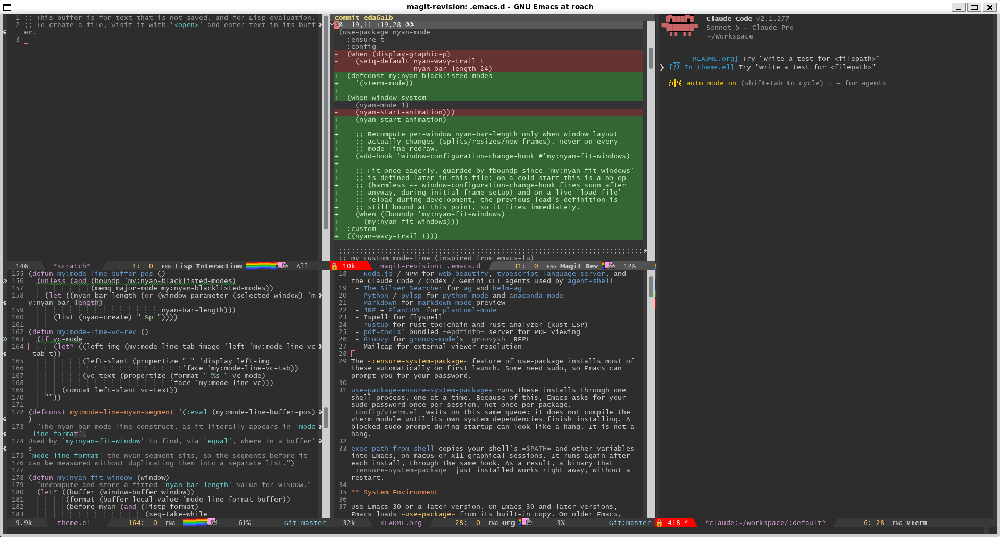
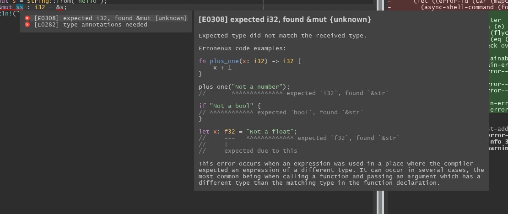

#+TITLE:.emacs.d
#+AUTHOR: Yunsik Jang
#+SETUPFILE: https://fniessen.github.io/org-html-themes/org/setup/html-theme-readtheorg.setup

#+CAPTION: Screenshot

This repository contains my current Emacs configuration. I designed it to suit my own preferences. Parts of it can be useful to you, especially if you develop in JavaScript, Python, or C/C++.

* How to Install

** Prerequisites

This configuration depends on a number of external system packages.

 - [[https://git-scm.com/][Git]] for [[https://magit.vc/][magit]]
 - [[https://cscope.sourceforge.net/][Cscope]] for [[https://github.com/dkogan/xcscope.el][xcscope]]
 - [[https://nodejs.org/][Node.js]] / NPM for [[https://github.com/yasuyk/web-beautify][web-beautify]], [[https://github.com/typescript-language-server/typescript-language-server][typescript-language-server]], and the Claude Code / Codex / Gemini CLI agents used by [[https://github.com/xenodium/agent-shell][agent-shell]]
 - [[https://github.com/ggreer/the_silver_searcher][The Silver Searcher]] for [[https://github.com/Wilfred/ag.el][ag]] and [[https://github.com/emacsorphanage/helm-ag][helm-ag]]
 - [[https://www.python.org/][Python]] / [[https://github.com/python-lsp/python-lsp-server][pylsp]] for [[https://gitlab.com/python-mode-devs/python-mode][python-mode]] and [[https://github.com/pythonic-emacs/anaconda-mode][anaconda-mode]]
 - [[https://daringfireball.net/projects/markdown/][Markdown]] for [[https://jblevins.org/projects/markdown-mode/][markdown-mode]] preview
 - [[https://openjdk.org/][JRE]] + [[https://plantuml.com/][PlantUML]] for [[https://github.com/skuro/plantuml-mode][plantuml-mode]]
 - Ispell for flyspell
 - [[https://rustup.rs/][rustup]] for rust toolchain and rust-analyzer (Rust LSP)
 - [[https://github.com/vedang/pdf-tools][pdf-tools]]' bundled =epdfinfo= server for PDF viewing
 - [[https://groovy-lang.org/][Groovy]] for [[https://github.com/Groovy-Emacs-Modes/groovy-emacs-modes][groovy-mode]]'s =groovysh= REPL

The ~:ensure-system-package~ feature of use-package installs most of these automatically on first launch. Some need sudo, so Emacs can prompt you for your password.

** System Environment

Emacs 30 or newer is recommended. On Emacs 30 and newer, Emacs loads ~use-package~ from its built-in copy. On older Emacs, =init.el= bootstraps [[https://github.com/radian-software/straight.el][straight.el]] and installs ~use-package~ through it.

** Compiler

The C/C++ header path detection works with GCC. If you use a different compiler, automatic include path discovery can fail.

** Installation

#+BEGIN_SRC sh
  mv ~/.emacs.d ~/.emacs.d.old
  git clone git@github.com:zeph1e/.emacs.d.git ~/.emacs.d
#+END_SRC

Emacs installs the remaining packages automatically on first launch.

* What's in here

Over many years of using Emacs, I built up many small pieces of code for convenience. This document covers the parts I built. I hope it helps you, either as a working configuration or as an idea source for your own.

* Architecture

The configuration is structured around a few top-level entry points:

 - =init.el= — Entry point. Sets up locale, UI, the Emacs server, backup directories, =package.el= / =use-package=, then loads =plugins/= and =config/=.
 - =config/= — One =.el= file per concern, for example =helm.el=, =lsp.el=, =git.el=. Emacs loads all files at startup and byte-compiles them when Emacs quits.
 - =plugins/= — Manually managed packages not on ELPA/MELPA. Byte-compilation and autoload generation happen once, on first load. A =.installed= sentinel file prevents Emacs from repeating this.
 - =workaround.el= — Loads early. It contains targeted fixes for upstream bugs.
 - =custom.el= — =M-x customize= generates this file automatically. Git excludes it from version control.

All custom keybindings live in ~my:global-key-map~, a minor mode that always takes precedence over major and minor mode keymaps. Bindings go into ~:map my:global-key-map~ inside ~use-package~ ~:bind~ blocks — never ~global-set-key~ directly.

* Basic Configuration

** UI & Locale

The UI starts minimal, with no toolbar, no menu bar, and no startup screen. ~global-hl-line-mode~ highlights the current line. The fill column is 80. ~display-fill-column-indicator-mode~ and [[https://github.com/jdtsmith/indent-bars][indent-bars-mode]] run in every ~prog-mode~ buffer. The locale is Korean, with UTF-8 encoding.

Fonts apply only in graphical sessions. [[https://fonts.google.com/specimen/Nanum+Gothic+Coding][Nanum Gothic Coding]] covers the Korean character range (U+1100 to U+FFDC). =Lucida Console= covers everything else. The frame starts maximized.

** Emacs Server

Emacs starts the server automatically on launch, and stores its type (=daemon=, =gui=, or =tty=) as a process property. The helper shell script =misc/edit= acts as a smart =emacsclient= wrapper. It reuses a running instance when one exists, and chooses =-c= or =-t= based on whether the server is graphical or terminal. Set =$EDITOR= to =edit= to integrate Emacs into your shell.

** Backups & Auto-saves

Emacs redirects all auto-generated files into hidden subdirectories under =~/.emacs.d= (=.backups=, =.auto-saves=, =.lock-files=). This keeps the filesystem clean and stops Tramp sessions from hanging on remote auto-save writes.

** Package System

The built-in =package.el= is the package manager. It uses GNU ELPA, NonGNU ELPA, and MELPA as archives. [[https://github.com/jwiegley/use-package][use-package]] is the standard way to declare packages. On Emacs 30 and newer, Emacs loads it from the built-in copy. On older Emacs, =init.el= bootstraps [[https://github.com/radian-software/straight.el][straight.el]] and installs it through that. For packages not on any archive, use-package's =:vc= keyword pulls them in directly — =package-vc-install= on Emacs 30 and newer, straight.el on older versions.

** Default Minor Modes

=init.el= installs three lists of default minor modes — one shared by both prog and text buffers, plus one each for prog-only and text-only:

| List                              | Hooks                            | Minor modes                                                                                              |
|-----------------------------------+----------------------------------+------------------------------------------------------------------------------------------------------------|
| ~my:default-minor-mode-list~      | both ~prog-mode~ and ~text-mode~ | ~display-line-numbers-mode~, ~my:whitespace-mode~                                                        |
| ~my:default-prog-minor-mode-list~ | ~prog-mode~ only                 | ~flyspell-prog-mode~, ~display-fill-column-indicator-mode~, ~goto-address-prog-mode~, ~indent-bars-mode~ |
| ~my:default-text-minor-mode-list~ | ~text-mode~ only                 | ~visual-line-mode~, ~flyspell-mode~, ~goto-address-mode~                                                 |

~global-hl-line-mode~ is off in shell, eshell, and term buffers, where the highlight distracts. ~display-fill-column-indicator-mode~ is off in ~helm-major-mode~.

* UX Configuration

** Look & Feel

*** Theme

I have used the Night Eighties variant of [[https://github.com/chriskempson/tomorrow-theme][Tomorrow Theme]] for most of my time with Emacs. The color contrast is well balanced and not too saturated. Emacs loads it from =plugins/color-theme-tomorrow=. My only change sets the ~highlight~ face background to =DeepSkyBlue4=, for better text contrast.

*** Mode Line

#+HTML: 

I customized the mode line myself, instead of using Powerline or similar packages. I wanted only the information I actually read:

 - Buffer size
 - Modification flag
 - Buffer name (red background when read-only)
 - Line and column
 - Input method indicator
 - Major mode
 - A [[https://github.com/TeMPOraL/nyan-mode][Nyan Cat]] progress bar
 - Scroll percentage
 - The vc-mode branch

Everything is in =config/theme.el=. For a starting point, see the [[https://emacs-fu.blogspot.com/2011/08/customizing-mode-line.html][Emacs-fu article on mode-line customization]].

** Helm & Company

I used [[https://www.gnu.org/software/emacs/manual/html_mono/ido.html][ido]] and [[https://github.com/auto-complete/auto-complete][autocomplete]] at first. I later switched to [[https://github.com/emacs-helm/helm][helm]] and [[https://company-mode.github.io/][company]], and I still use them today.

*** Helm

[[https://github.com/emacs-helm/helm][Helm]] replaces ido for all interactive selection, configured in =config/helm.el=. The most useful customization is ~my:helm-find-files-backward-dwim~. Pressing =<backspace>= in a file path deletes one directory level, instead of one character. This makes navigation of deep paths much faster.

| Key                 | Command                                  |
|---------------------+-------------------------------------------|
| =M-x=               | ~helm-M-x~                               |
| =C-x C-f=           | ~helm-find-files~                        |
| =C-x b=             | ~helm-mini~                              |
| =M-y=               | ~helm-show-kill-ring~                    |
| =M-r=               | ~helm-occur~                             |
| =M-R=               | ~helm-do-grep-ag~                        |
| =C-h a=             | ~helm-apropos~                           |
| =C-h b=             | ~helm-descbinds~                         |
| =C-x C-p= / =C-x p= | Projectile command map (helm-projectile) |

[[https://github.com/emacs-lsp/helm-lsp][helm-lsp]] replaces ~xref-find-apropos~ with a helm-powered workspace symbol search when LSP is active.

*** Company

[[https://company-mode.github.io/][Company]] is enabled globally. Completion is triggered with =C-;=. You navigate candidates with =C-p= / =C-n=, and page through them with =C-v= / =M-v=.

The ~my:make-context-aware~ macro advises company backends so each one only fires in its matching context. In ~prog-mode~ buffers, and in major modes listed in ~my:custom-prog-mode-list~, ~company-capf~, ~company-keywords~, and ~company-dabbrev-code~ skip comments and strings, while ~company-ispell~, ~company-files~, and ~company-dabbrev~ fire only inside them. Outside those buffers — in ~text-mode~, for example — all backends fire without restriction.

[[https://github.com/sebastiencs/company-box][company-box]] renders completion candidates with icons.

For C/C++, ~company-c-headers~ uses compiler include paths detected at runtime. It runs =gcc -x c -E -v -= and parses the output. It also picks up Qt headers automatically when =qmake= is available. Mode-specific backends:

| Mode                        | Backends                       |
|-----------------------------+---------------------------------|
| web-mode                    | company-web-html, company-css  |
| css-mode, less-css-mode     | company-css                    |
| c-mode, c++-mode, objc-mode | company-c-headers               |
| python-mode                 | company-anaconda                |

* Editing

** Multi-editing

[[https://github.com/victorhge/iedit][iedit]] (=C-M-#=) edits all occurrences of a symbol within its scope at the same time — ideal for quick in-buffer renaming. [[https://github.com/magnars/multiple-cursors.el][multiple-cursors]] works better for structured multi-line edits:

| Key   | Command                 |
|-------+-------------------------|
| =M-.= | Mark next like this     |
| =M-,= | Mark previous like this |
| =M-/= | Mark all like this      |
| =M-?= | Edit lines in region    |

** Custom Editing Commands

A collection of small ergonomic commands in =config/editor.el=:

| Key           | Command                                                         |
|---------------+-----------------------------------------------------------------|
| =M-@=         | Mark word at point                                              |
| =M-#=         | Mark symbol at point                                            |
| =M-SPC=       | Jump to first non-blank character on line                       |
| =M-S-SPC=     | Collapse surrounding whitespace to one space (~just-one-space~) |
| =C-o=         | Open new line above                                             |
| =M-o=         | Insert new line below                                           |
| =M-p= / =M-n= | Move up / down by code block ([[https://github.com/emacs-vs/block-travel][block-travel]])                     |
| =<f12>=       | Toggle buffer read-only                                         |

An advice on ~kill-line~ cleans up leading whitespace after the kill. This prevents orphaned indentation.

** Whitespace

~my:whitespace-mode~ wraps the built-in ~whitespace-mode~ with mode-aware style. In ~prog-mode~ it highlights trailing whitespace, long lines (beyond fill-column), and tabs. In ~text-mode~ it omits the long-line indicator. This avoids noise in prose.

** Undo / Redo

[[https://www.emacswiki.org/emacs/RedoPlus][redo+]] (=plugins/redo+=) adds conventional linear redo on top of Emacs' built-in undo system.

* Window Management

All bindings are in =config/window.el=.

| Key               | Action                                       |
|-------------------+------------------------------------------------|
| =C-<arrow>=       | Move focus to adjacent window                |
| =S-<arrow>=       | Swap current window with adjacent ([[https://github.com/konstantinblaesi/windswap][windswap]]) |
| =C-S-<arrow>=     | Copy buffer to adjacent window ([[https://github.com/dholm/windcopy][windcopy]])    |
| =M-<arrow>=       | Move focus across frames ([[https://github.com/tlikonen/framemove][framemove]])         |
| =C-x \= / =C-x -= | Split horizontally / vertically              |
| =C-x \|= / =C-x _= | Split and move into new window ([[https://github.com/nex3/windsplit][windsplit]])  |
| =C-x x=           | Close current window                         |
| =C-{= / =C-}=     | Shrink / enlarge window horizontally         |

windcopy helps you duplicate a buffer into a split view without disturbing the other window. framemove hooks into windmove, so =C-<arrow>= wraps across frames automatically. A patch changes scrolling so =C-v= / =M-v= at the buffer boundary moves to the end or beginning, instead of signaling an error.

* Project Navigation & Search

** Projectile

[[https://github.com/bbatsov/projectile][Projectile]] provides project-aware file finding and buffer switching, with one-week caching. [[https://github.com/bbatsov/helm-projectile][helm-projectile]] provides the helm front end. The project search root defaults to =~/Workspace=. Both =C-x C-p= and =C-x p= open the command map.

** Search

| Key       | Tool                                                             |
|-----------+---------------------------------------------------------------------|
| =M-r=     | ~helm-occur~ — incremental in-buffer search                      |
| =M-R=     | ~helm-do-grep-ag~ — full-text search across a directory tree     |
| =C-M-r=   | ~my:helm-do-grep-vc-root-ag~ — same, rooted at the VCS repo root |
| =C-M-S-r= | ~helm-grep-do-git-grep~ — =git grep= through helm                |

** Cscope

[[https://github.com/dkogan/xcscope.el][xcscope]] provides C/C++ symbol cross-referencing through ~cscope-setup~. It helps in large codebases where LSP indexing is impractical.

* Version Control

Git integration centers on [[https://magit.vc/][magit]], configured in =config/git.el=.

| Key           | Command                       |
|---------------+---------------------------------|
| =C-x RET C-s= | Magit status                  |
| =C-x RET C-h= | Log for HEAD                  |
| =C-x RET C-b= | Blame                         |
| =C-x RET C-f= | Find file in another revision |
| =C-x RET C-l= | Log for current buffer's file |

[[https://github.com/jonathanchu/magit-gh][magit-gh]] integrates GitHub CLI (=gh=) actions into the magit interface. Commit message buffers narrow ~fill-column~ to 70, to keep subject lines within the conventional limit.

* AI Agent Integration

** Claude Code

[[https://github.com/stevemolitor/claude-code.el][claude-code.el]] (=config/claude.el=) runs the [[https://github.com/anthropics/claude-code][Claude Code]] CLI inside Emacs. It binds the CLI under the =C-'= keymap prefix and opens it in a right-side window. [[https://github.com/stevemolitor/monet][monet]] bridges IDE-style features back into Emacs. Claude Code's process environment hooks into =monet-start-server-function=. =config/claude.el= comments out the =:custom= block for =monet-diff-tool= and =monet-ediff-tool=. As a result, monet runs with its own default diff tool. [[https://github.com/purcell/inheritenv][inheritenv]] propagates buffer-local environment variables, for example Tramp connections, into the Claude Code subprocess. Inside the Claude Code map, =M= cycles auto-accept, plan, and confirm modes (~claude-code-cycle-mode~).

** Agent Shell

[[https://github.com/xenodium/agent-shell][agent-shell]] (=config/agent-shell.el=, =C-"=) is a more general chat-shell front end for CLI coding agents such as Claude, Codex, and Gemini, over [[https://agentclientprotocol.com/][ACP]]. [[https://github.com/junyi-hou/agent-shell-tramp][agent-shell-tramp]] extends it to run agent sessions on Tramp remotes.

* LSP

[[https://emacs-lsp.github.io/lsp-mode/][lsp-mode]] is configured in =config/lsp.el= with the keymap prefix =C-c C-l=. Active language hooks: =js-mode=, =typescript-mode=, =python-mode=, =web-mode=, =rust-mode=, =kotlin-mode=. =config/lsp.el= comments out the C/C++ hooks.

For Rust, a conditional setup function, ~my:lsp-rust-setup-conditional-project~, fills in a synthetic =lsp-rust-analyzer-linked-projects= entry. It runs when a buffer has no =Cargo.toml= or =rust-project.json= ancestor. This way, single-file =.rs= buffers still get rust-analyzer support.

~:ensure-system-package~ installs most required language servers automatically:

| Language          | Server                       | Install command                               |
|-------------------+-------------------------------+--------------------------------------------------|
| JS / TS           | typescript-language-server   | ~npm -g install typescript-language-server~   |
| HTML / CSS / JSON | vscode-langservers-extracted | ~npm -g install vscode-langservers-extracted~ |
| Python            | pylsp                        | ~sudo apt install -y python3-pylsp~           |
| Rust              | rust-analyzer (via rustup)   | ~sudo apt install -y rustup~ or the rustup.rs installer, then =rustup component add rust-analyzer rust-src= |

Kotlin's language server is not auto-installed. =config/lsp.el= has commented-out =gh release download= commands for [[https://github.com/fwcd/kotlin-language-server][kotlin-language-server]] and [[https://github.com/fwcd/kotlin-debug-adapter][kotlin-debug-adapter]]. Fetch them manually and put their =bin/= directories on =$PATH=.

[[https://emacs-lsp.github.io/lsp-ui/][lsp-ui]] provides inline diagnostics and hover documentation. [[https://github.com/emacs-lsp/helm-lsp][helm-lsp]] replaces ~xref-find-apropos~ with a helm workspace symbol search.

* Language Support

** Web / JavaScript / TypeScript

[[https://web-mode.org/][web-mode]] handles =.html= and =.php= files. JS, TS, CSS, and markup all use 2-space indentation. [[https://github.com/yasuyk/web-beautify][web-beautify]] (=C-c b=) formats JS, HTML, and CSS with =js-beautify=. JS/TS completion and diagnostics come from the LSP servers below, rather than a dedicated company backend.

** Python

[[https://github.com/pythonic-emacs/python-mode][python-mode]] uses 2-space indentation. [[https://github.com/pythonic-emacs/anaconda-mode][anaconda-mode]] provides in-buffer documentation and navigation. ~company-anaconda~ feeds completions into company. =pylsp= via =lsp-mode= covers full LSP analysis. Indent shift is on =C-c C-.= / =C-c C-,=, with =C-c .= / =C-c ,= as terminal-safe aliases.

** C / C++

=.h= files open in =c++-mode=. Indentation uses spaces throughout. ~company-c-headers~ provides header completion with paths auto-detected from GCC and qmake. Symbol navigation uses xcscope. LSP is disabled here.

** Rust

[[https://github.com/rust-lang/rust-mode][rust-mode]] handles Rust files. rust-analyzer provides completion and diagnostics (see LSP above).

Three commands live in =config/rust.el=:

| Key             | Command                           |
|-----------------+-------------------------------------|
| =C-c C-c C-a=   | ~my:rust-add-dependency~          |
| =C-c C-c C-d=   | ~my:rust-remove-dependency~       |
| =C-c C-c C-e=   | ~my:rust-explain-error-at-point~  |

~my:rust-add-dependency~ searches the cargo registry with =cargo search= through helm or =completing-read=. It caches results per keyword for the session, then runs =cargo add= on the chosen package. ~my:rust-remove-dependency~ lists the current workspace's direct dependencies with =cargo tree --depth 1= and runs =cargo remove=.

#+CAPTION: my:rust-explain-error-at-point

~my:rust-explain-error-at-point~ shows the =rustc --explain= output for the flycheck error at point, in a posframe popup. It syntax-highlights any embedded code blocks. When multiple errors overlap at point, it opens a company-box-style picker instead (=C-n= / =C-p= to cycle, =C-g= to dismiss). The picker lists each error next to its explanation, and suppresses lsp-ui-doc's and flycheck's own popups while it is shown.

** Kotlin

[[https://github.com/Emacs-Kotlin-Mode-Maintainers/kotlin-mode][kotlin-mode]] handles Kotlin files. =lsp-mode= hooks in for completion and diagnostics, once kotlin-language-server is installed (see LSP above).

** Groovy

[[https://github.com/Groovy-Emacs-Modes/groovy-emacs-modes][groovy-mode]] handles =.groovy= files and runs the =groovysh= REPL.

* Build

=<f7>= calls ~recompile~ when a previous compilation buffer exists. Otherwise it opens the interactive ~compile~ prompt. =C-<f7>= always opens the interactive prompt. =config/compile.el= configures both.

* External File Viewer

=config/fileviewer.el= routes external file opens and URL navigation to the host's default viewer, with awareness of where Emacs is running:

 - *WSL* — uses =wslview= so files and URLs open in the Windows host.
 - *SSH-remote* (=$SSH_CLIENT= set) — falls back to local =xdg-open= when a graphical display is available. Otherwise, it skips the operation.
 - *Local* — uses =xdg-open=, =gnome-open=, =kde-open=, or =open=, whichever is found.

In dired, =V= invokes the resolved viewer on the file at point. For remote files, it first copies the file to a temp file. It rejects remote directories, and refuses remote files larger than 5 MB, so the local copy stays bounded. ~browse-url-browser-function~ points to the same opener, so external links land in the host browser. On WSL, =mailcap= viewer entries also route through =wslview=.

*** SSH-remote setup

When Emacs runs on a remote server, ~browse-url~ resolves URLs by connecting back to the workstation with =ssh= (the host in =$SSH_CLIENT=) and running =xdg-open= there. For this to work without prompts, set up the following:

 1. *Reverse SSH access* — The workstation must run =sshd=. Install the remote-host user's public key in =~/.ssh/authorized_keys= on the workstation, so password or passphrase prompts do not block Emacs.
 2. *Username mapping* — =ssh= defaults to the current user on the remote host. If your workstation login differs from your login on the remote host, add an entry to =~/.ssh/config= on the *remote* host:

    #+BEGIN_SRC conf
      Host <workstation-host-or-ip>
          User <workstation-username>
          IdentityFile ~/.ssh/id_ed25519
    #+END_SRC

    The =Host= pattern must match the IP returned by =$SSH_CLIENT= (the first whitespace-separated field) — typically the workstation's outbound address as seen from the server.
 3. *Host key trust* — The workstation's host key must already be in the remote host's =~/.ssh/known_hosts=. Otherwise, the first connection blocks on a confirmation prompt. Connect once by hand (=ssh <workstation>=) before you rely on URL handling.

For dired =V= on the SSH-remote case, Emacs does not use reverse SSH. It runs the *local* =xdg-open= and relies on graphical display forwarding (X11 or Wayland) to render on the workstation. Launch =emacs= with a working =$DISPLAY=, for example through =ssh -X= or =-Y=, for this branch to work.

* PDF Viewing

[[https://github.com/vedang/pdf-tools][pdf-tools]] (=config/pdf.el=) opens =.pdf= files in ~pdf-view-mode~, backed by the =epdfinfo= server process from the =elpa-pdf-tools-server= system package.

* Snippets & Note Taking

[[https://github.com/joaotavora/yasnippet][YASnippet]] is enabled globally. Custom snippets go in the =snippets/= directory.

[[https://jblevins.org/projects/deft/][Deft]] (=M-g d= or =C-x RET C-d=) provides fast plain-text note browsing. Notes live in =~/Documents/deft= with recursive search, defaulting to the =.org= extension.

* Org Mode

=config/org.el= configures Org Babel language support. At startup, it checks for the relevant executables, for example =gcc=, =g++=, =python=, =gnuplot=, and =java=, to determine language availability. PlantUML blocks use the jar that =plantuml-mode= configures. The configuration includes [[https://github.com/hniksic/emacs-htmlize][htmlize]] for syntax-highlighted HTML export.

* License

For my own code, it is free to use. Packages under =plugins/= follow their own license notices.
